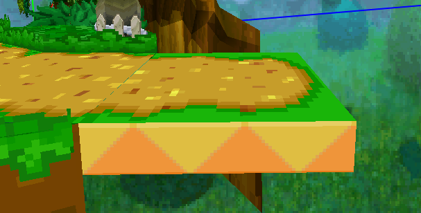
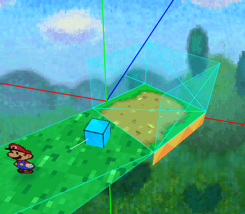

# Map Transitions

This tutorial covers creating transitions between maps. In Paper Mario, there's a few different ways to move between maps.

- Loading Zones
- Doors (single or double)
- Pipes (horizontal or vertical)

In this tutorial, only the loading zone is discussed for now. Doors and pipes work very similarly, but there's some things you need to watch for that aren't relevant for loading zones.

## Loading Zones
Loading zones are platforms Mario can walk on to go to a new map. They often look like this.

In order to add one of these to your own map, just model it yourself or copy the model from a different map and place it in your own. Change the floor texture if applicable. Add a collider to the floor, and make sure to give that collider a unique name that you can reference later. Surround the loading zone with wall colliders as well so Mario doesn't fall off. Add an entry right in front of your loading zone, with the white line facing *away* from the loading zone. This entry determines the direction Mario walks in when he leaves the map.

Now, in the top right of the map editor, go to "Scripts", then "Generators". Right click "Exit", and select "Add Walk". Give your exit a name, and specify the exit's destination map and destination entry. For the Exit Marker, use the marker you just created. For the Exit Collider, use the floor collider of the LZ. And that's it! Now, in the menu bar at the top, just click Build Geometry, Build Collision and Generate Script, then save your map. Your map now has a working loading zone, and you can test it either in-game or directly in the map editor!